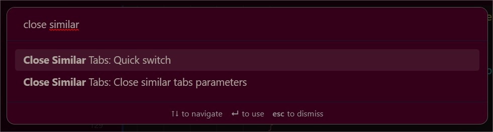
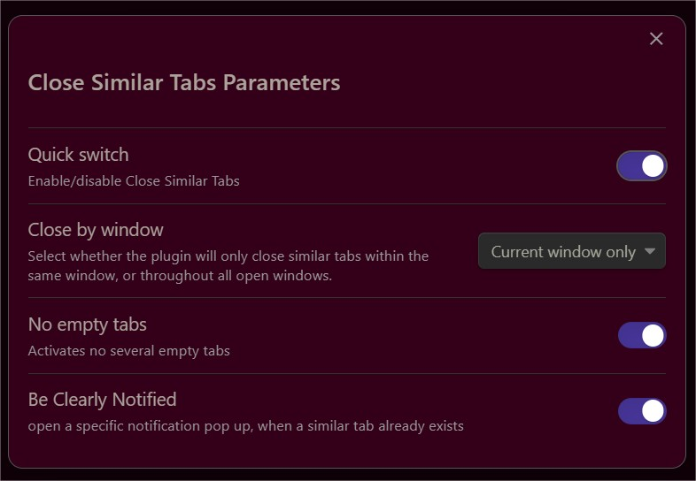

# Close similar tabs

This plugin prevents you from having duplicate tabs in Obsidian by automatically closing them.  

2 modes:
    - "by window": closes duplicates in each window independently
    - "All windows": if you reopen same file in a different window, the duplicate is closed. inside a window same as first option. 

other options:
    - "No empty tabs" to avoid empty tabs duplicates in each window.
    - "Be clearly Notified" indicates clearly what's happened.

You can split normally a file, it won't close the duplicate tab.
Opening a link, without pressing ctrl, duplicate tab is closed.

2 commands:  
    - "Close Similar Tabs parameters" to open a modal with preferences.
    - "Quick switch" to rapidely turn on/off Close Similar Tabs. it doesn't disable the plugin. (linked to the parameter in preferences)

"Quick switch", in preferences, to enable/disable Close Similar Tabs, without having to disable the plugin.

Commands

Parameters

