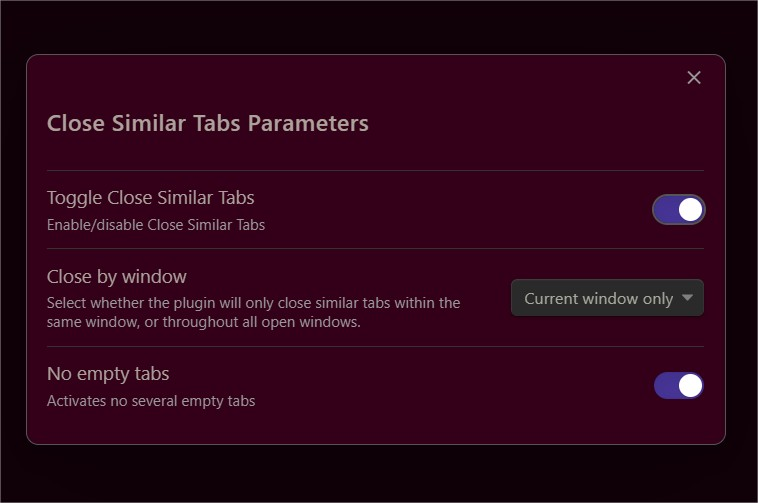

# Close similar tabs

This plugin prevents you from having duplicate tabs in Obsidian by automatically closing them.  
By default, it closes duplicates within each window, but users can set the "Close by window" setting to "Current window only" or "All windows". With this second setting, it's impossible to have the same tab open twice anywhere in your Obsidian workspace.  
edit: now split panels are supported

New settings:  
"No empty tabs" to avoid new empty tabs duplicates. (the new one is kept)  
"Toggle Close Similar Tabs" to enable/disable Close Similar Tabs  
But these settings can be directly accessed from the Command palette with the command "Close Similar Tabs parameters"

So you can temporarly turn off Close Similar Tabs
or quickly change any parameter. 

